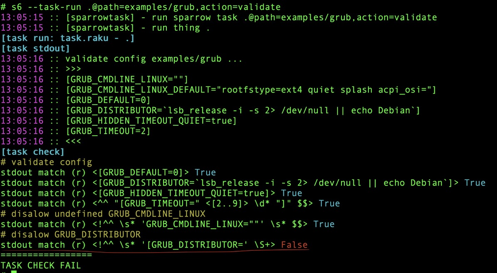

# Synopsis

This is a simple test suite that tests different installation combinations of alpine.

# Dependencies

Raku, python, pexpect, qemu-system-x86_64 


# Install

```bash
zef install --/test Tomty
```


# Run tests

```bash
tomty --all 
# [1/1] / [boot] .......  25 sec. OK
# =========================================
# (=: / [1] tests in 25 sec / (1) tests passed
```

Run single test with details

```bash
tomty boot
```

# Example report



# See also

https://github.com/melezhik/Tomty - Raku test framework

