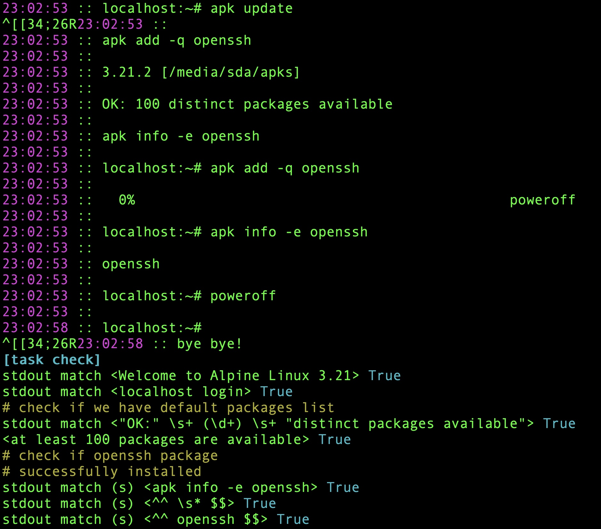

# Synopsis

This is a simple test suite that tests different installation combinations of alpine.

Test steps:

* Boot to qemu x86_64 from iso file
* Login
* Runs apk update and check default repo list
* Install openssh packge and check it is indeed installed

# Dependencies

Raku, python, pexpect, qemu-system-x86_64 

# Install

```bash
zef install --/test Tomty
```

# Get test iso

```bash
wget https://dl-cdn.alpinelinux.org/alpine/v3.21/releases/x86_64/alpine-standard-3.21.2-x86_64.iso
```

# Run tests

```bash
tomty --all 
# [1/1] / [boot] .......  25 sec. OK
# =========================================
# (=: / [1] tests in 25 sec / (1) tests passed
```

Run single test with details

```bash
tomty boot
```

# Example report

Full log in text format - https://gist.github.com/melezhik/dd94d53fb016bfb1fbe3d845a5b531c2



# See also

https://github.com/melezhik/Tomty - Raku test framework

